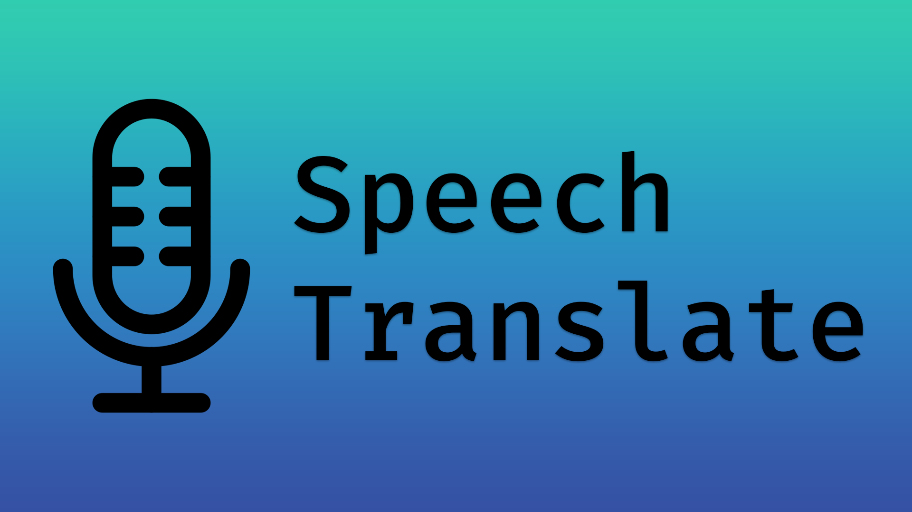

# Speech Translate Rev

Speech Translate Rev is a modern WebView-based speech transcription and translation desktop app.

[](https://github.com/silverpoetry/speech-translate-rev/actions/workflows/ci.yml)
[](https://github.com/silverpoetry/speech-translate-rev/releases)
[](LICENSE)
[](https://www.python.org/)
[](#requirements)
[](https://github.com/silverpoetry/speech-translate-rev/releases)

<p align="center">
  
</p>

## Overview

Speech Translate Rev is a heavily modified desktop speech tool built around Whisper, faster-whisper, stable-ts, translation backends, and a WebView UI. It supports realtime microphone or speaker transcription, live translation, detached subtitle windows, and file transcription workflows.

This repository keeps the original `speech_translate` Python package name for compatibility, while presenting the application and distribution metadata as `Speech Translate Rev`.

## Features

- Realtime speech transcription from microphone or speaker input.
- Realtime translation with selectable source and target languages.
- Modern WebView frontend with a compact production-tool shell.
- File transcription workbench for audio and video batch processing.
- Model manager for checking, downloading, and loading Whisper models.
- Detached transcription and translation windows for subtitle-style display.
- Runtime/controller refactor for WebView bridge state, recording, models, settings, and imports.
- Interface language support for Simplified Chinese and English.
- Configurable text rendering, recording behavior, proxy settings, decoding options, and export paths.

## Requirements

- Python 3.10 or newer.
- Windows, macOS, or Linux for source installation.
- Windows 10 or newer is recommended for the current WebView-focused desktop experience.
- Optional CUDA-capable GPU for faster Whisper inference.
- Internet access is required only for model downloads and online translation providers.

Speaker loopback capture depends on the operating system and audio setup. On Windows it is available through supported host APIs; on other platforms you may need a virtual audio device.

## Installation

Prebuilt releases will be published from the [GitHub Releases](https://github.com/silverpoetry/speech-translate-rev/releases) page.

Install from source:

```powershell
git clone --recurse-submodules https://github.com/silverpoetry/speech-translate-rev.git
cd speech-translate-rev
python -m venv .venv
.\.venv\Scripts\Activate.ps1
pip install -r requirements.txt
```

For Python 3.14, use the compatibility requirements file:

```powershell
pip install -r requirements-py314.txt
```

For CUDA builds, install the matching PyTorch packages for your machine before or alongside the requirements. See the official PyTorch installation guide for the correct index URL.

## Run From Source

```powershell
python Run.py
```

Alternative module entry point:

```powershell
python -m speech_translate
```

Editable install:

```powershell
pip install -e .
speech-translate-rev
```

The legacy `speech-translate` console command is kept as a compatibility alias.

## Build

Windows executable build:

```powershell
python build.py build_exe
```

The build script uses cx_Freeze and outputs to `build/SpeechTranslateRev <version> <environment>`. The Inno Setup script in `installer.iss` can create an installer after the executable build succeeds.

Packaging and release automation are intentionally conservative in the first Rev release. CI validates syntax and tests, while release assets should be reviewed before publishing.

## Configuration

Most user settings are managed inside the app:

- Realtime input mode, host API, microphone and speaker devices.
- Model backend, model directory, model loading and cache state.
- Transcription and translation languages.
- Whisper decoding parameters and prompt options.
- Detached window size, position, opacity, colors, and click-through behavior.
- Proxy, logging, export, and runtime behavior.

User state is stored under `speech_translate/_user/` during local development and is ignored by Git.

## Internationalization

The Web UI currently supports:

- Simplified Chinese (`zh-CN`)
- English (`en-US`)

The interface language can be changed from the settings page. Runtime strings that come from task state are normalized in the Web UI so the major panels can switch language without restarting the app.

## Development

Run the fast checks:

```powershell
node --check speech_translate/web/app.js
python -m py_compile Run.py speech_translate/__main__.py speech_translate/webview_app.py speech_translate/web_bridge_api.py
python -m pytest
```

Useful project areas:

- `speech_translate/web/` - WebView frontend, detached windows, tray panel, and UI preview.
- `speech_translate/web_bridge_api.py` - bridge API exposed to the frontend.
- `speech_translate/app_runtime.py` and controller modules - runtime coordination.
- `speech_translate/model_manager.py` - model cache and loading state.
- `test/` - unit tests for controllers, runtime state, WebView contracts, and workflows.

## Attribution

Speech Translate Rev is a heavily modified derivative of [Dadangdut33/Speech-Translate](https://github.com/Dadangdut33/Speech-Translate), originally licensed under the MIT License.

The Rev project keeps the original MIT license notice and preserves attribution to the upstream author. Major changes in this derivative include:

- WebView frontend and modern shell UI work.
- Runtime/controller restructuring.
- File transcription workbench updates.
- Model manager and detached window improvements.
- Settings synchronization and color controls.
- Interface language support.
- Expanded tests around runtime, controller, and WebView behavior.

Third-party assets and submodules keep their own licenses. The bundled `speech_translate/assets/silero-vad` submodule comes from [snakers4/silero-vad](https://github.com/snakers4/silero-vad) and includes its own license files.

## License

This project is licensed under the MIT License. See [LICENSE](LICENSE) and [NOTICE.md](NOTICE.md).
