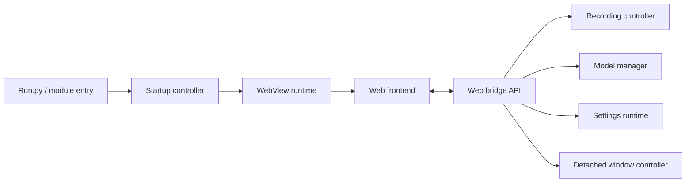

# Speech Translate Rev Architecture

Speech Translate Rev keeps the original `speech_translate` Python package name, but the current desktop app is organized around a WebView frontend and a Python runtime/controller layer.

## Runtime Shape

- `Run.py` starts the application through `speech_translate.__main__`.
- The desktop window is created by the WebView startup/runtime modules.
- The frontend lives in `speech_translate/web/` and talks to Python through the WebView bridge API.
- User settings, runtime state, recording state, model state, and detached-window state are exposed to the frontend as structured view data.

## WebView Frontend

The main UI is built from `index.html`, `styles.css`, and `app.js`. `ui-preview.html` mirrors the production DOM for screenshot review, contract tests, and visual QA.

The frontend is intentionally state-driven:

- It renders realtime transcription and translation status.
- It mirrors file transcription queues and export settings.
- It displays model cache and download state.
- It keeps detached transcription/translation window controls synchronized with settings.

## Bridge And Controllers

The WebView bridge is the public boundary between JavaScript and Python. JavaScript should call bridge actions instead of reaching into Python internals.

Controllers own behavior and runtime state:

- Recording controller: microphone/speaker/file capture orchestration.
- Model manager: backend/model selection, cache checks, and load state.
- Settings runtime: persisted settings and normalized UI-facing values.
- Detached window controller: subtitle-style windows, geometry, visibility, and text styling.
- Tray runtime: compact status and app actions from the system tray.

## Packaging

Rev uses Python 3.14 as the primary validation target. Packaging metadata lives in `pyproject.toml`; `setup.py` remains only as a compatibility shim.

Windows release builds use `.venv314`, cx_Freeze, and Inno Setup. Release assets are expected to include a portable zip and a Windows installer.

## Compatibility Notes

- The Python import namespace remains `speech_translate` for compatibility with the upstream project history.
- The project is a heavily modified derivative of `Dadangdut33/Speech-Translate`; attribution is preserved in `NOTICE.md` and `README.md`.
- macOS and Linux source installation remain documented, but the first Rev binary release target is Windows.
